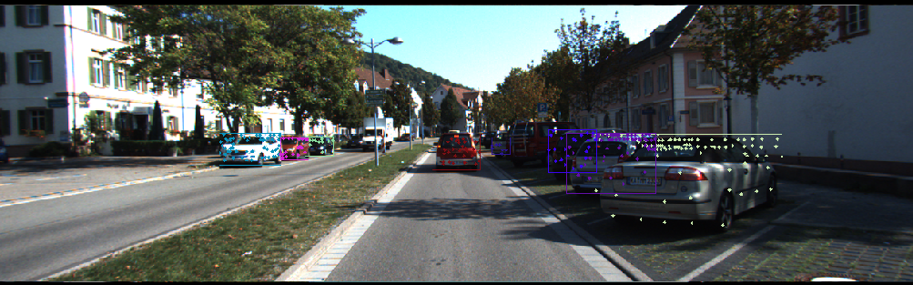
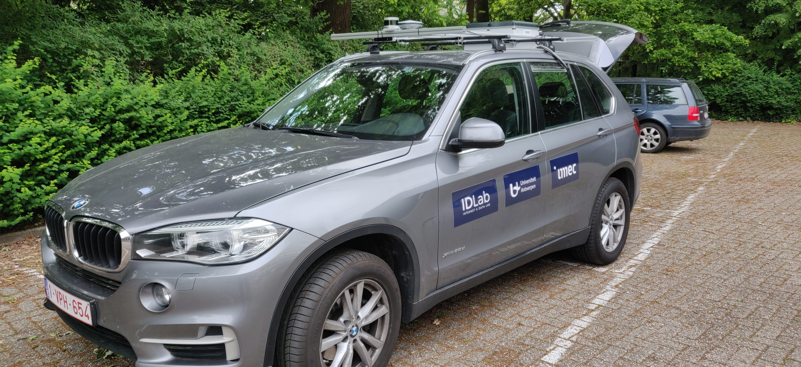
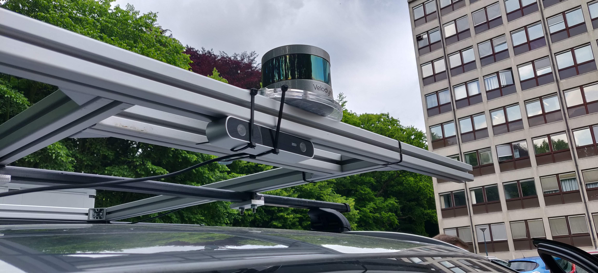

# LiDAR and Camera Sensor Fusion

Welcome my documentation for my master's thesis on LiDAR and Camera fusion for autonomous applications. Links to the project's code can be found here:

* [Carla modules](https://github.com/Dieter97/SensorFusion_Carla)
* [ROS Nodes](https://github.com/Dieter97/SensorFusion_ros)
 
 
 
 
 
---

## Overview
This documentation includes:

* [Dependencies installation](Tech Report/Documentation/installation.md)
* [Quick start guide](Tech Report/Documentation/start.md)
* [Running the evaluation](Tech Report/Documentation/evaluation.md)
* [Portfolio documents](Administration/docs.md)

