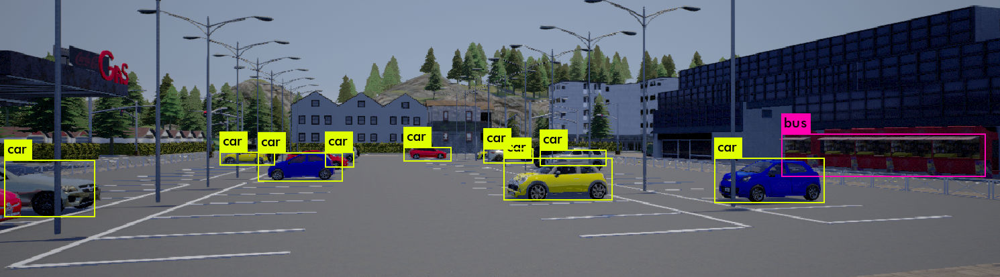

# LiDAR and Camera Sensor Fusion

Welcome my documentation for my master's thesis on LiDAR and Camera fusion for autonomous applications. Links to the project's code can be found here:

* [Carla modules](https://github.com/Dieter97/SensorFusion_Carla)
* [ROS Nodes](https://github.com/Dieter97/SensorFusion_ros)

 
---

## Overview
This documentation includes:

* [Dependencies installation](installation.md)
* [Quick start guide](start.md)
* [Running the evaluation](evaluation.md)
* [Portfolio documents](docs.md)
* [ROS messages and topic overview](ros.md)

